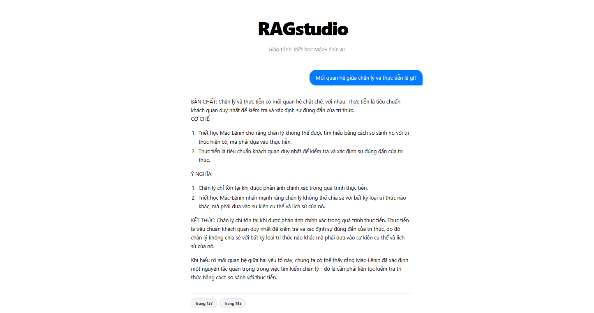

# RAGstudio 
<p align="center">
  
</p>

<p align="center">
  
  
  
  
  
</p>

---

## 🌟 Overview
**RAGstudio** is a sophisticated, **100% Offline** Retrieval-Augmented Generation (RAG) pipeline designed for complex academic domains like Philosophy. This project tackles the common pitfalls of Small Language Models (SLMs) by utilizing a Hybrid Retrieval strategy and strict prompt engineering to eliminate hallucinations and ensure high-fidelity responses.

## Key Engineering Highlights
*   **Hybrid Retrieval Engine:** Combines **FAISS (Dense Search)** for deep semantic understanding with **BM25 (Sparse Search)** for precise keyword matching. Results are fused using the **Reciprocal Rank Fusion (RRF)** algorithm.
*   **Fully Asynchronous Pipeline:** Architected with **FastAPI** and `ollama.AsyncClient` to support non-blocking concurrent requests and real-time token streaming.
*   **Hallucination Control:** Features a "Direct Strike" system prompt that mandates **Inline Citations** (e.g., *Page 15*) and forces the model to decline queries outside the provided knowledge base.
*   **Semantic Data ETL:** A custom ETL pipeline that handles PDF noise reduction, automatic line-break healing, and semantic-aware chunking for optimal embedding quality.

---
Installation & Setup
1. Prerequisites

    Python 3.11+

    Ollama: Download at ollama.com. After installation, pull the model:
    Bash

    ollama pull qwen2.5:1.5b

2. Project Setup
Bash

# Clone the repository
git clone [https://github.com/thianh05/RAGmini.git](https://github.com/thianh05/RAGmini.git)
cd RAGmini

# Create and activate virtual environment
python -m venv venv
# Windows:
venv\Scripts\activate
# Linux/macOS:
source venv/bin/activate

# Install dependencies
pip install -r requirements.txt

3. Environment Configuration (.env)

Create a .env file in the root directory to store your local configuration:
Code snippet

OLLAMA_BASE_URL=http://localhost:11434
MODEL_NAME=qwen2.5:1.5b
EMBEDDING_MODEL=intfloat/multilingual-e5-small

Usage Instructions
Step 1: Data Ingestion

Place your curriculum PDFs in backend/data/, then run:
Bash

python backend/src/main_ingest.py

Step 2: Launch the System

Open two terminals:

    Terminal 1 (Backend):
    Bash

    uvicorn backend.src.server:app --reload

    Terminal 2 (Frontend):
    Bash

    streamlit run frontend/app.py


---

## Technology Stack
*   **Core:** FastAPI, Streamlit, AsyncIO.
*   **AI/ML:** Ollama, FAISS, BM25, HuggingFace Transformers (E5-Small).
*   **Formatting:** Be Vietnam Pro Font, Custom CSS (Apple UI Vibe).

Final Steps to Push:

    Save the file in VS Code.

    Run these commands in your CMD:

Bash

git add README.md
git commit -m "docs: complete professional English README with technical specs"
git push origin main
## System Architecture

```mermaid
graph TD
    subgraph Offline_ETL [Offline: Data Ingestion & Indexing]
        A[Raw PDF Documents] --> B(Clean & Semantic Chunking)
        B --> C[HuggingFace Embeddings]
        C --> D[(FAISS Vector Index)]
        B --> E[(BM25 Inverted Index)]
    end

    subgraph Online_Inference [Online: Real-time QA]
        F[User Query] --> G[Streamlit Frontend]
        G --> H(FastAPI Backend)
        H --> I{Hybrid Searcher}
        I -->|Semantic| D
        I -->|Keyword| E
        D & E --> J[RRF Fusion Re-ranking]
        J --> K(Strict Prompt Builder)
        K --> L[Ollama Local LLM]
        L -->|Streaming Tokens| G
    end
    
    style L fill:#f06595,stroke:#333,stroke-width:2px
    style D fill:#51cf66,stroke:#333,stroke-width:2px
    style E fill:#51cf66,stroke:#333,stroke-width:2px
